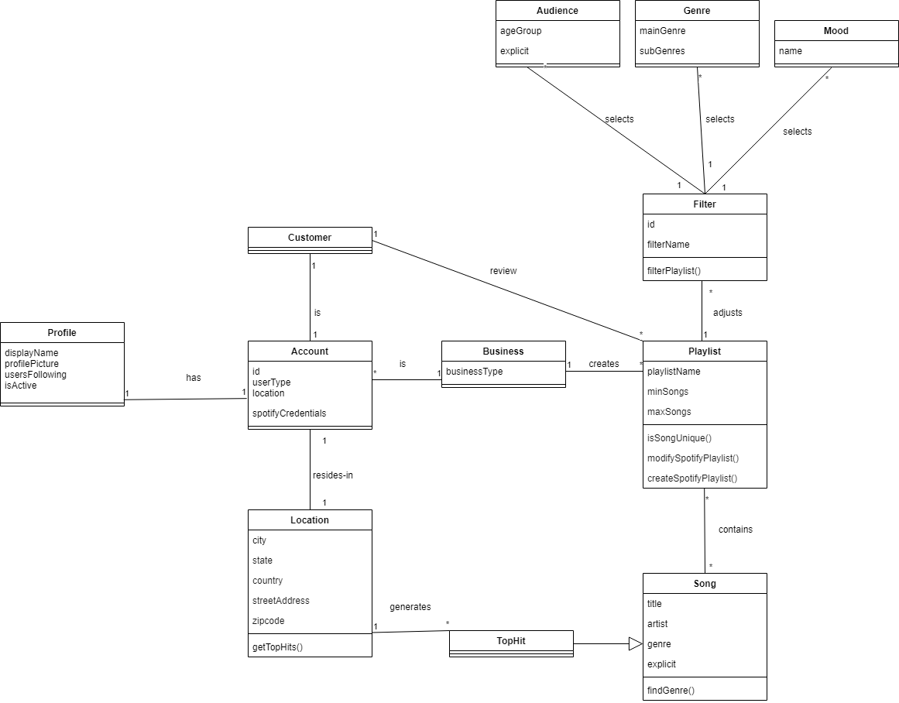

# Requirements

*Group 06 – `PinPlay`\
Date: `02/28/2021`\
Group Members: Karina Anaya, Sophia Frohna, Samantha Milligan, Jacob Penney, Emily Ramirez Serrano, Lucina de la Rosa*

## 1. System Description

Oftentimes, restaurants, cafes, and many other **businesses** play music without catering to their **customer** demographic. Without knowledge of local popular music, **business** owners limit their **customer** outreach; the impact of which is the lack of appeal to the local community’s music taste. This ultimately leads to lower **customer** satisfaction.

Our solution eliminates these problems. PinPlay is a web application designed for **business** owners to automatically generate **playlists** based on popular music in their area. Unlike Spotify's collection of top hits from a *country*, our product designs **playlists** *city* by *city* so that every person and region feels at home with our music. Essentially, Pinplay allows **businesses** to quickly and easily <ins>create</ins> **playlists** that appeal to local **customer** taste.

With PinPlay, users will be able to enter their location and enable filters to customize every **playlist**. Users can also create, view, and follow **profiles** to share and <ins>review</ins> **playlists**. All new **playlists** will automatically sync to a user’s current Spotify **account**. PinPlay is also affordable and easy to use. Users can automatically generate new **playlists** at any time without expected fees at this time. Using Spotify’s platform alongside our product allows users the luxury of multiple **playlist** generators without the additional cost. This also guarantees security with *Spotify’s login information*; no user information will be shared for other purposes or other applications.

Our developers, Karina Anaya, Sophia Frohna, Samantha Milligan, Jacob Penney, Emily Ramirez Serrano, and Lucina de la Rosa are the primary stakeholders. Our team develops the specifications and requirements for this software. We also test and improve the application for our various clients. The most important stakeholders are PinPlay users. This group, alongside our developers, will test and use the application to debug and improve usability. This group will offer improvements to the application’s design to create a more user-friendly product. Lastly, Spotify and Shazam are stakeholders with similar platforms to PinPlay. Developers will use these applications to review and improve on the product design.

In our system, users that are **business** owners will be able to turn off/on **filters**, select **business** **location**, <ins>create</ins>/edit/delete **playlists**, and <ins>select</ins> their **customer** **audience**. Users with a **customer** **profile** will <ins>review</ins> and endorse **playlists** as well as select the closest *city* to them on the platform. All users will be able to share their current **location** and view, share, and listen to **playlists**. Lastly, all users can create, follow, and view user **profiles** on the application. These lists of user abilities were created from the following goals:
  1. **Business** owners want to display their **business** **location** to attract more **customers**.
  2. **Business** owners need **filters** to select the appropriate *age* of their **audience**.
  3. **Business** owners want new popular music to appear trendy to their **customers**.
  4. **Customers** want to <ins>review</ins> **business playlists** to offer feedback to **businesses**.
  5. **Customers** want to view **business** **playlists** to see if they will like the **business**.
  6. Users want to view other user **profiles** to collaborate and share **playlists**.

## 2. Model

