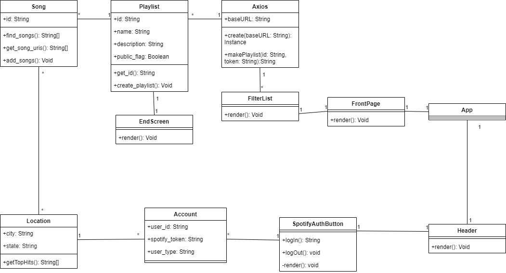

# Design

## Description

## Architecture

  This design represents an attempt to diagram the PinPlay system, as it currently is, in a language/technology-agnostic way. Upon visiting pinplay.me, the user is greeted with the user interface and has the ability, through it, to navigate to Spotify’s login interface to login to their account. This is done via communication between the client web site, which itself is stored and operated from a different location than the backend server which supports it, and Spotify’s API. After the user logs in via the Spotify login interface, the web app collects information about the user from the Spotify API which the backend server, hosting our application’s business logic, can use to fulfill its functionalities. The web app communicates this information to the backend server, which structures the data and creates a request to the Spotify API with it. An empty playlist is generated in the user’s account. The backend uses information given back by the Spotify API to then add tracks to the empty playlist. Pertinent information is returned from the Spotify API about this playlist, which is structured by logic in the backend server and given to the web client. Finally, the web page embeds the created playlist to display to the user.   

## Class Diagram

## Sequence Diagram
Use case: User Login
Precondition: User is not logged in, user already has Spotify account
Postcondition: User is logged in

Basic Path:
1. User accesses login page and enters login info
2. App sends login info to Spotify Auth for authorization
3. Spotify Auth authorizes login for app
4. App logs user into account
5. User is logged in and free to use app

Alternate paths:
a. At any point, user may cancel operation
3a. Spotify Auth may deem login info incorrect, cancelling operation

## Design Patterns
**Design Pattern (Behavioral) - Command**\
The Axios object encapsulates all of the information from the backend so that it can accessed by the front end easily.\
\
Playlist: https://github.com/samantha-milligan/heroku/blob/a12535afa9f77e134e4fe15d9dc37ceec00b0e7d/pinplay_api/views.py \
Axios: https://github.com/emily-ramirez/PinPlay/blob/master/pinplay_front/src/apis/django.js \
FilterList: https://github.com/emily-ramirez/PinPlay/blob/master/pinplay_front/src/components/Filters.js \

**Design Pattern (Structural) - Flyweight**\
When you use create() on Axios with a baseURL, this allows the app to have an absolute URL for every request. This design pattern fits because we do not have to keep creating a object every single time a request is made. \
\
Axios: https://github.com/emily-ramirez/PinPlay/blob/master/pinplay_front/src/apis/django.js

## Design Principles
Because of the way our project is currently set up, we don’t need to follow a lot of the SOLID principles; principles like the Open/Closed Principle, Liskov Substitution Principle, Interface Segregation Principle, and the Dependency Inversion principle are not needed because we currently do not have any classes extending other classes or declaring other classes and then using functions from them; as a result the principles for these cannot be applied. However, the one SOLID principle that still does apply to our code is the Single Responsibility Principle. With the Single Responsibility Principle, we are making sure that each class is only in charge of one thing: each class is in charge of only things directly related to it and only has functions relating to said class. For example, while playlist creation behavior was once in the class that also handled get requests, it has now been put into its own playlist specific class.
