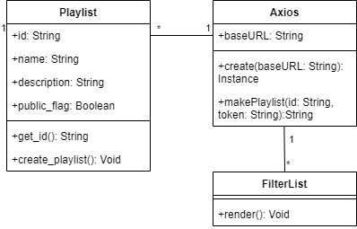
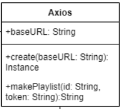

# Design

## Description

## Architecture

## Class Diagram

## Sequence Diagram
Use case: User Login
Precondition: User is not logged in, user already has Spotify account
Postcondition: User is logged in

Basic Path:
1. User accesses login page and enters login info
2. App sends login info to Spotify Auth for authorization
3. Spotify Auth authorizes login for app
4. App logs user into account
5. User is logged in and free to use app

Alternate paths:
a. At any point, user may cancel operation
3a. Spotify Auth may deem login info incorrect, cancelling operation

## Design Patterns
**Design Pattern (Behavioral) - Command**\
The Axios object encapsulates all of the information from the backend so that it can accessed by the front end easily.\
\
Playlist: https://github.com/samantha-milligan/heroku/blob/1dc08ae01d93746a8937c520a9ee9a2287402109/pinplay_api/views.py\
Axios: https://github.com/emily-ramirez/PinPlay/blob/master/pinplay_front/src/apis/django.js \
FilterList: https://github.com/emily-ramirez/PinPlay/blob/master/pinplay_front/src/components/Filters.js \\

**Design Pattern (Structural) - Flyweight**\
When you use create() on Axios with a baseURL, this allows the app to have an absolute URL for every request. This design pattern fits because we do not have to keep creating a object every single time a request is made. \
\
Django: https://github.com/emily-ramirez/PinPlay/blob/master/pinplay_front/src/apis/django.js

## Design Principles
