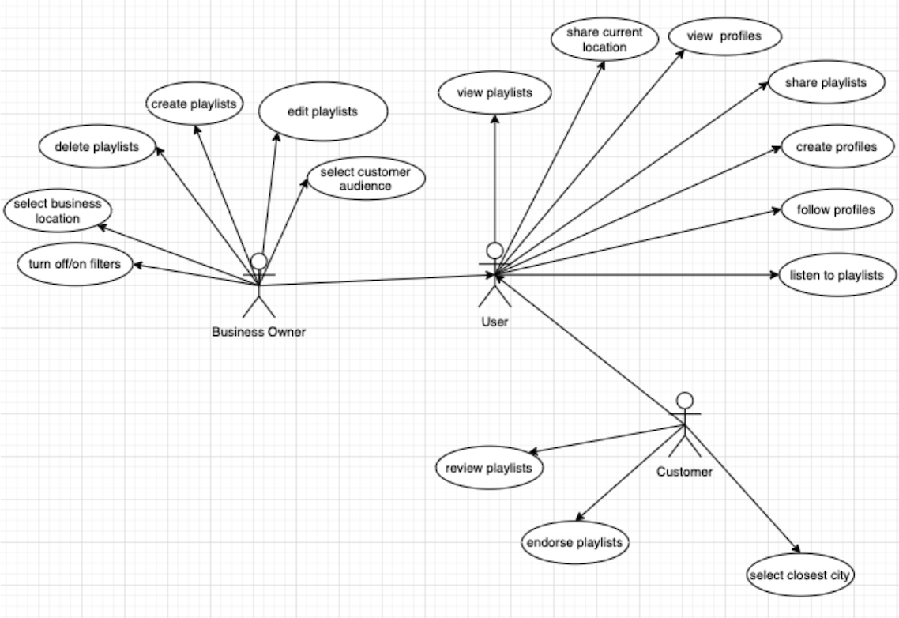
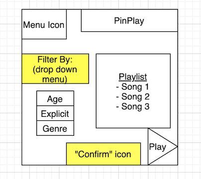
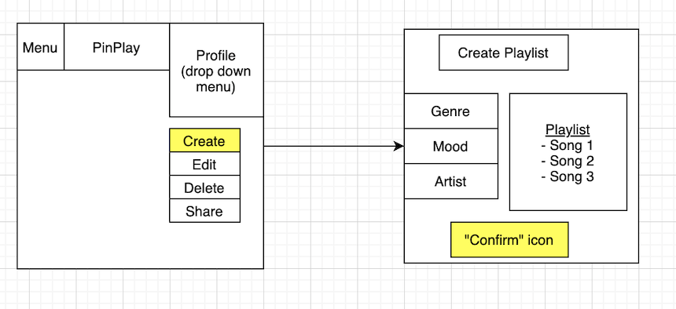
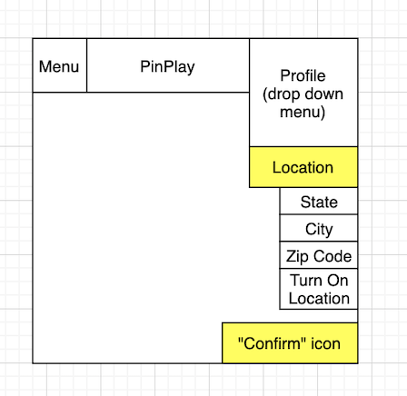
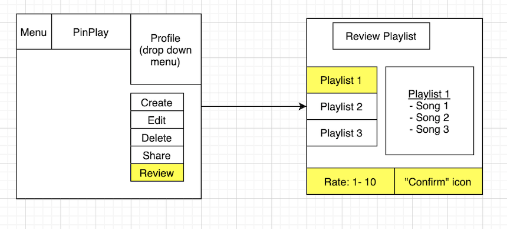
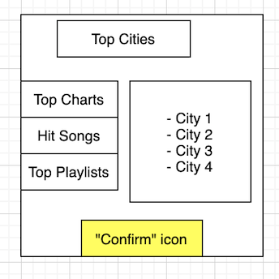
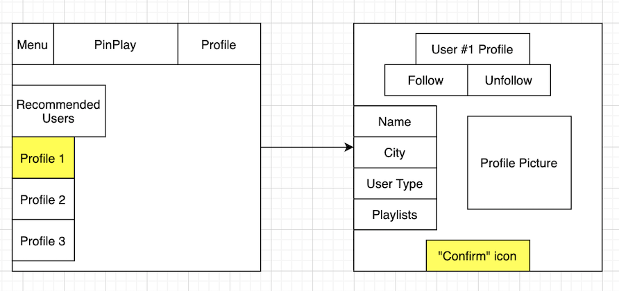

# Requirements

*Group 06 – `PinPlay`\
Date: `02/21/2021`\
Group Members: Karina Anaya, Sophia Frohna, Samantha Milligan, Jacob Penney, Emily Ramirez Serrano, Lucina de la Rosa*

## 1. Positioning
### 1.1 Problem statement

The problem of creating playlists without the knowledge of local popular music greatly affects business owners and their customer outreach; the impact of which is a lack of appeal to the local community’s music taste and lower customer satisfaction.

### 1.2. Product Position Statement

For business owners who want to easily create a playlist, Pinplay is a web application designed to automatically generate playlists based on popular music in their area. Unlike Spotify's collection of top hits from a country, our product designs playlists catered from city to city so that every person and region feels at home with our music.

### 1.3. Value proposition and consumer segment

Value Proposition:
* Pinplay allows business owners to quickly and easily create playlists based on popular music preferences, appealing to local customer taste.

Consumer Segment:
- Any business owner or worker who utilizes music
- Customers who want to listen to playlists from a business

## 2. Stakeholders
 

## 3. Functional requirements (features)

## 4. Non-functional requirements

1. Usability: Users will be able to interact with the system easily. A user who has never seen our product before will be able to generate a playlist without needing an explanation.
2. Security: Users’ login information will be communicated securely from the application to Spotify. Users’ login information will not be shared with other applications.
3. Affordability: Users will not be expected to pay any fees or subscriptions. A user who already possesses Spotify Premium will be able to access their Spotify Premium account without additional payments to our app.
4. Reliability: The application will be consistently usable and bugs will be infrequent. Users will be able to access the application at all hours except when down for maintenance.
5. Variety: Users will benefit from variety and randomness in the generation of playlists. A user will be able to generate two unique playlists within the same genre by modifying other filters.
6. Performance: Playlists will generate quickly without straining the server or users’ computers. Users will be able to run another app concurrently without straining their CPU.

## 5. MVP
Our minimum viable product will be a web application that can generate and save a playlist based on a user’s location and input filters to a user’s Spotify library. The filters will be added one at a time as team members complete the implementation. We will validate the playlist generation features by testing the generator under different conditions and filters that we input. We will validate the save feature by logging into a Spotify account through the web app and saving a playlist to the account’s library.

## 6. Use cases
### 6.1. Use case diagram

### 6.2. Use case descriptions

**Use Case 1**: Turn on/off filters\
**Actor**: Business Owner\
**Description**: The business owner will be able to turn filters on/off on already created playlists\
**Preconditions**: A playlist has already been created\
**Postconditions**: The playlist will be played with the specified filters\
**Main Flow**: 
1. The business owner selects the “filters” option
2. The system shows a list of filters for the business to select
3. The business owner selects the filters they want applied to the playlist.
4. The system asks the business owner to confirm.
5. The business owner confirms
6. The system plays the playlist with the selected filters

**Alternative Flow**:\
a. At any time, the business owner cancels the operation 
1. The system cancels all the operations done so far 

b. There are no songs associated with the selected filter(s)
1. The system notifies the user
2. the operation does not create any modifications

**User Interface Sketch**:\

**Use Case 2**: Create playlists\
**Actor**: Business Owner\
**Description**: The business owner will be able to create playlists\
**Preconditions**: The business owner is logged into the system\
**Postconditions**: A playlist is created on the account\
**Main Flow**: 
1. The business owner selects the “create playlist” option
2. The system shows a list of genres, moods, and other options
3. The business owner selects the options for the playlist
4. The system asks for the length of the playlist
5. The business owner inputs the length 
6. The system asks the business owner to confirm 
7. The business owner confirms
8. The system creates a playlist on the business owner’s account

**Alternative Flow**:\
a. At any time, the business owner cancels the operation 
1. The system cancels all the operations done so far

**User Interface Sketch**:

**Use Case 3**: Select Business Location\
**Actor**: Business owner\
**Description**: The business owner will designate where the business is located\
**Preconditions**: The business owner is logged into the system\
**Postconditions**: The business will have a location\
**Main Flow**:
1. The business owner selects the “set business location” option
2. The system asks the business owner for location details
3. The business owner informs the system of their business location
4. The system asks the business owner to confirm
5. The business owner confirms
6. The system updates the business location

**Alternative Flow**:\
a. At any time, the business owner cancels the operation 
1. The system cancels all the operations done so far

**User Interface Sketch**:

**Use Case 4**: Review Playlists\
**Actor**: Customer\
**Description**: The customer will review a playlist\
**Preconditions**: The customer is on a playlist\
**Postconditions**: The playlist will have an updated review\
**Main Flow**: 
1. The customer selects the “Rate Playlist” option
2. The system asks the customer for review information
3. The customer provides the system with review information
4. The system asks the customer to confirm
5. The customer confirms
6. The system updates the reviews on the playlist

**Alternative Flow**: \
a. At any time, the business owner cancels the operation 
1. The system cancels all the operations done so far

**User Interface Sketch**:

**Use Case 5**: Select Near Location\
**Actor**: Customer\
**Description**: The customer will select a location to find playlists made near them\
**Preconditions**: The customer is logged into the system\
**Postconditions**: Playlists made near them will be displayed\
**Main Flow**: 
1. The customer selects a city from a list 
2. The system asks the customer to confirm 
3. The customer confirms
4. The system displays playlists from the selected location
 
**Alternative Flow**: \
a. At any time, the business owner cancels the operation 
1. The system cancels all the operations done so far

**User Interface Sketch**:

**Use Case 6**: Follow Profiles\
**Actor**: User\
**Description**: A user will be able to follow other user profiles\
**Preconditions**: The user is logged into the system and is on a different user’s profile\
**Postconditions**: The user will be following a profile\
**Main Flow**: 
1. The user selects the “Follow User” or “Unfollow User” option
2. The system updates who the user is following
3. The system updates the number of users following the profile

**Alternative Flow**: \
a. At any time, the business owner cancels the operation 
1. The system cancels all the operations done so far

**User Interface Sketch**:

# 7. User stories

**User story 1**: As a user, I want to filter explicit songs so that I can make a family-friendly playlist.\
Priority: 3\
Estimated Hours: 4

**User story 2**: As a business owner, I want to edit my playlists so that I can make changes where I see fit.\
Priority: 2\
Estimated Hours: 6

**User story 3**: \
Priority: \
Estimated Hours: 

**User story 4**: \
Priority: \
Estimated Hours: 

**User story 5**: \
Priority: \
Estimated Hours: 

**User story 6**: \
Priority: \
Estimated Hours: 

**User story 7**: \
Priority: \
Estimated Hours: 

**User story 8**: \
Priority: \
Estimated Hours: 

**User story 9**: \
Priority: \
Estimated Hours: 

**User story 10**: \
Priority: \
Estimated Hours: 

**User story 11**: \
Priority: \
Estimated Hours: 

**User story 12**: \
Priority: \
Estimated Hours: 

## 8. Trello Issue Tracker
Must include Backlog, To Do in the Current Release, Doing, and Done

